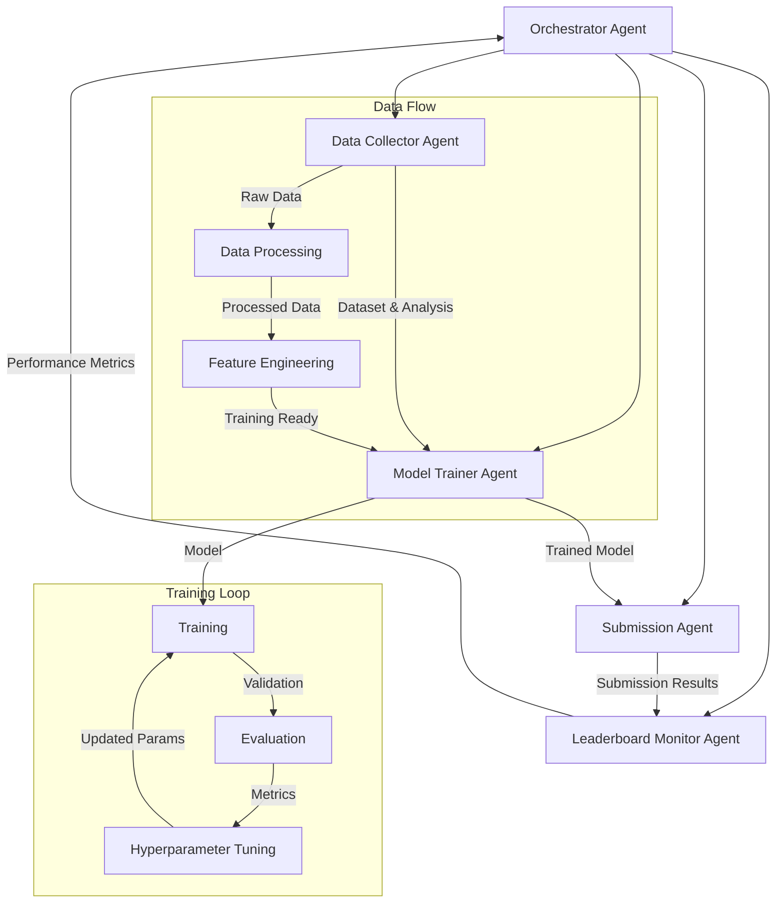
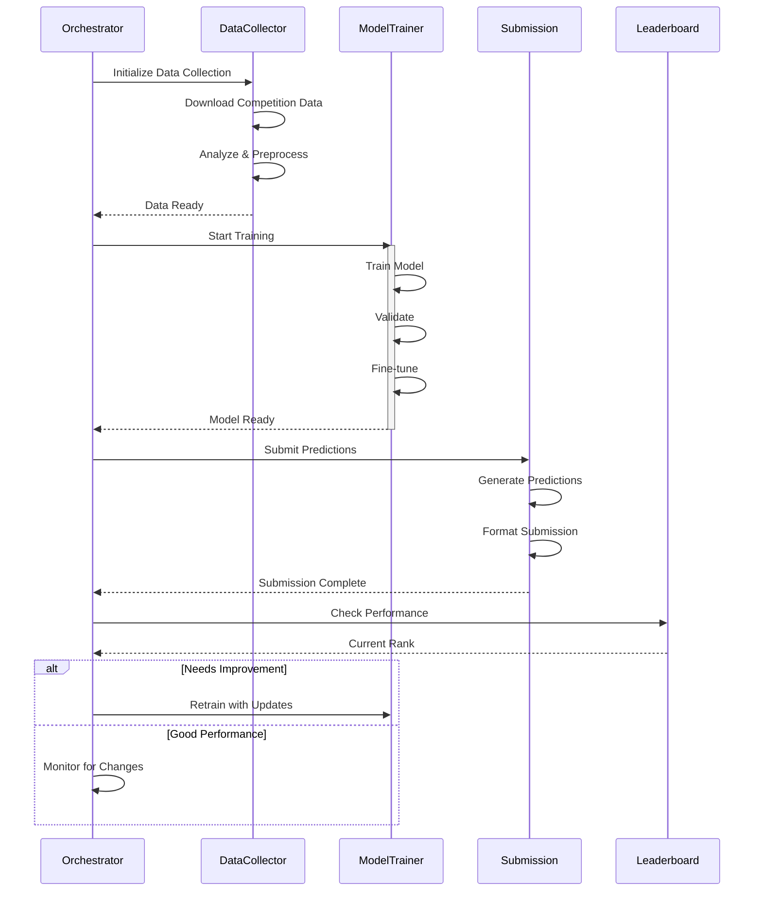
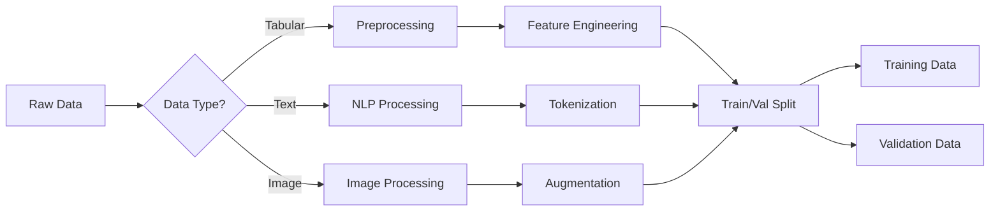
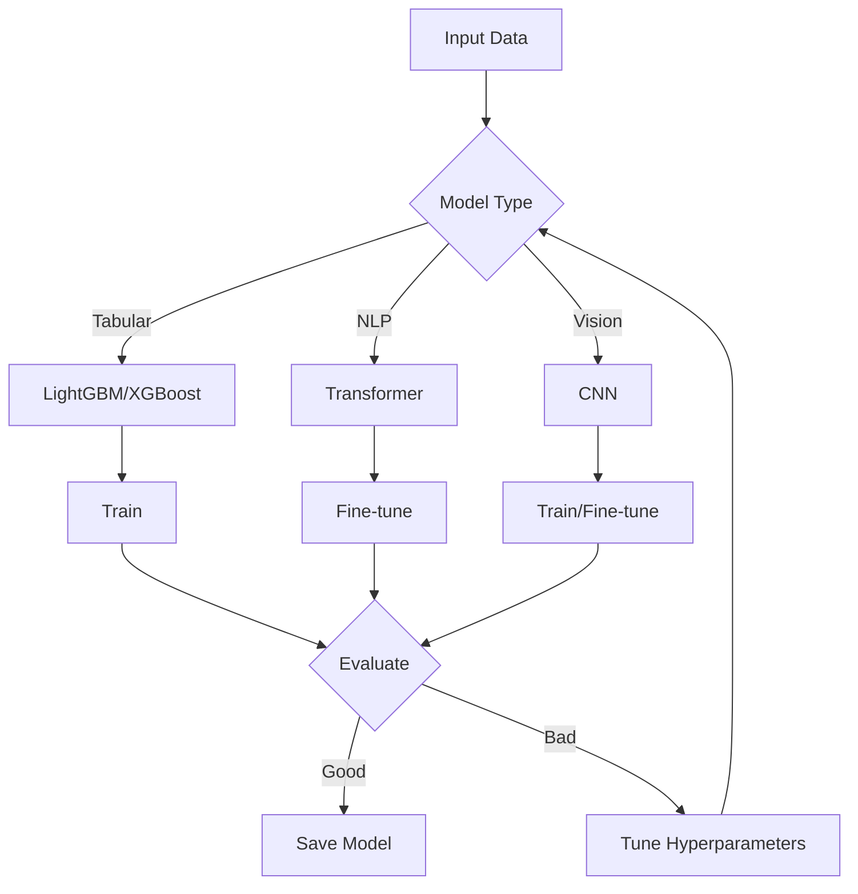
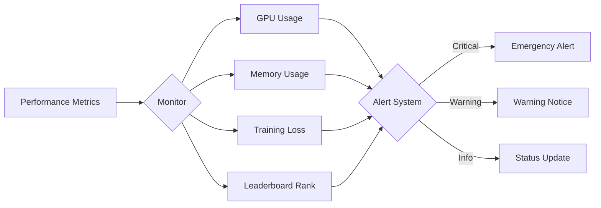

# Kaggle Competition Multi-Agent System

## 📋 Executive Summary
This project implements an advanced multi-agent system for automating Kaggle competition workflows. Key highlights:

- **Fully Automated:** End-to-end automation from data collection to submission
- **Intelligent Agents:** Specialized agents for data, training, submission, and monitoring
- **Model Support:** Handles tabular, NLP, and computer vision tasks
- **Production Ready:** Includes monitoring, logging, and deployment configurations
- **Extensible:** Easy to customize for specific competition requirements

[](https://www.python.org/downloads/)
[](LICENSE)
[](https://github.com/psf/black)

---

## 🎯 Overview
A sophisticated multi-agent system designed to automate and optimize participation in Kaggle competitions. This system uses a team of specialized agents coordinated by an orchestrator to handle everything from data collection to model submission.

## 🔧 Prerequisites

- Python 3.8 or higher
- CUDA-compatible GPU (recommended for deep learning models)
- Kaggle account and API credentials
- 16GB RAM minimum (32GB recommended for large datasets)
- 100GB disk space for datasets and model storage

Optional but recommended:
- Docker for containerized deployment
- GPU with 8GB+ VRAM for transformer models
- Unix-based system (Linux/MacOS) for full script support


## 🏗️ Architecture

### System Overview


### Competition Lifecycle


### Data Processing Pipeline


### Model Training Pipeline


### Monitoring System


### Orchestrator Agent (Manager)
The central control unit that coordinates all other agents and manages the competition workflow.

**Key Responsibilities:**
- Decomposes competition goals into specific sub-tasks
- Initializes and monitors specialized agents
- Manages data flow between agents
- Triggers model retraining based on leaderboard performance
- Implements the main competition lifecycle loop

### Specialized Agents

#### 1. Data Collector Agent 📊
**Purpose:** Handles all data-related tasks
- Downloads competition datasets via Kaggle API
- Gathers external datasets through web scraping
- Performs initial data analysis and exploration
- Generates comprehensive data reports

**Tools:**
- Kaggle API for dataset access
- BeautifulSoup4 for web scraping
- Pandas for data analysis
- Requests for external data collection

#### 2. Model Trainer Agent 🤖
**Purpose:** Manages model selection, training, and optimization

**Capabilities:**
- Automatic model selection based on data type:
  - Tabular: LightGBM, XGBoost, PyTorch MLP
  - NLP: Hugging Face models (Mistral-7B, Llama-2, GPT-OSS)
  - Computer Vision: CNN architectures
- Training pipeline implementation:
  - Data preprocessing
  - Model training
  - Checkpoint management
- Efficient fine-tuning using QLoRA for LLMs

#### 3. Submission Agent 📤
**Purpose:** Handles model predictions and competition submissions

**Functions:**
- Loads best model checkpoints
- Generates predictions on test data
- Formats submissions according to competition requirements
- Submits solutions via Kaggle API

#### 4. Leaderboard Monitor Agent 📈
**Purpose:** Tracks competition performance

**Features:**
- Real-time leaderboard monitoring
- Performance analysis
- Automated triggering of model improvements
- Progress reporting to orchestrator

## 🚀 Getting Started

### Prerequisites
```bash
pip install -r requirements.txt
```

### Configuration
1. Set up Kaggle API credentials:
   ```bash
   mkdir -p ~/.kaggle
   # Download kaggle.json from https://www.kaggle.com/settings/account
   # Move kaggle.json to ~/.kaggle/
   chmod 600 ~/.kaggle/kaggle.json
   ```

2. Install dependencies:
   ```bash
   pip install -r requirements.txt
   ```

## 🔧 Supported Model Types

### Tabular Data
- LightGBM
- XGBoost
- PyTorch MLP

### NLP Tasks
- Hugging Face Transformers
- Support for efficient fine-tuning (QLoRA)
- Popular models: Mistral-7B, Llama-2, GPT-OSS

## 📈 Features

- **Automated Workflow:** End-to-end automation of competition participation
- **Intelligent Model Selection:** Automatic choice of appropriate models
- **Performance Optimization:** Continuous monitoring and improvement
- **Scalable Architecture:** Easy to extend with new agents and capabilities
- **Error Handling:** Robust error management and recovery
- **Progress Tracking:** Detailed logging and performance monitoring

## 📁 Project Structure
```
.
├── src/
│   ├── agents/                     # Agent implementations
│   │   ├── __init__.py
│   │   ├── base.py                # Base agent class
│   │   ├── orchestrator.py        # Orchestrator agent
│   │   ├── data_collector.py      # Data collection agent
│   │   ├── model_trainer.py       # Model training agent
│   │   ├── submission.py          # Submission agent
│   │   └── leaderboard.py         # Leaderboard monitoring agent
│   ├── models/                    # Model implementations
│   │   ├── __init__.py
│   │   ├── tabular/              # Tabular models (LightGBM, XGBoost)
│   │   ├── nlp/                  # NLP models and fine-tuning
│   │   └── vision/               # Computer vision models
│   ├── data/                     # Data processing utilities
│   │   ├── __init__.py
│   │   ├── preprocessing.py      # Data preprocessing
│   │   ├── augmentation.py       # Data augmentation
│   │   └── validation.py         # Data validation
│   ├── utils/                    # Utility functions
│   │   ├── __init__.py
│   │   ├── logging.py           # Logging utilities
│   │   ├── monitoring.py        # System monitoring
│   │   └── visualization.py     # Visualization tools
│   ├── config/                  # Configuration files
│   │   ├── __init__.py
│   │   ├── model_config.yaml    # Model configurations
│   │   └── logging_config.yaml  # Logging configurations
│   └── main.py                  # Main application entry
├── tests/                       # Test suite
│   ├── __init__.py
│   ├── test_agents/            # Agent tests
│   ├── test_models/           # Model tests
│   └── test_data/            # Data processing tests
├── notebooks/                  # Jupyter notebooks for analysis
│   ├── data_exploration.ipynb
│   ├── model_evaluation.ipynb
│   └── performance_analysis.ipynb
├── examples/                   # Example implementations
│   ├── tabular_competition/
│   ├── nlp_competition/
│   └── vision_competition/
├── docs/                      # Documentation
│   ├── agents.md             # Agent documentation
│   ├── models.md            # Model documentation
│   └── api.md              # API documentation
├── scripts/                  # Utility scripts
│   ├── setup.sh            # Setup script
│   ├── train.sh           # Training script
│   └── deploy.sh         # Deployment script
├── logs/                   # Log files
│   ├── system.log
│   └── training.log
├── models/                 # Saved models
│   ├── checkpoints/
│   └── final/
├── data/                   # Data storage
│   ├── raw/               # Raw competition data
│   ├── processed/         # Processed data
│   └── external/          # External datasets
├── .env                   # Environment variables
├── .gitignore            # Git ignore file
├── requirements.txt       # Project dependencies
├── requirements-dev.txt   # Development dependencies
├── setup.py              # Package setup file
├── Dockerfile            # Docker configuration
├── docker-compose.yml    # Docker compose configuration
├── LICENSE              # License file
└── README.md           # Project documentation
```

## 🛠️ Advanced Usage

### Custom Model Integration

#### 1. Custom Tabular Model
```python
class CustomTabularTrainer(ModelTrainerAgent):
    def train_custom_model(self, data, target_column):
        # Example with custom preprocessing and model pipeline
        from sklearn.compose import ColumnTransformer
        from sklearn.pipeline import Pipeline
        from sklearn.preprocessing import StandardScaler, OneHotEncoder

        # Define preprocessing
        numeric_features = ['age', 'salary']
        categorical_features = ['department', 'position']

        preprocessor = ColumnTransformer(
            transformers=[
                ('num', StandardScaler(), numeric_features),
                ('cat', OneHotEncoder(), categorical_features)
            ])

        # Create custom pipeline
        model_pipeline = Pipeline([
            ('preprocessor', preprocessor),
            ('regressor', XGBRegressor(
                n_estimators=1000,
                learning_rate=0.01,
                max_depth=5
            ))
        ])

        # Train model
        model_pipeline.fit(data, data[target_column])
        return model_pipeline

#### 2. Custom NLP Model with Fine-tuning
```python
class CustomNLPTrainer(ModelTrainerAgent):
    def setup_model(self):
        # Load pre-trained model and tokenizer
        self.model = AutoModelForSequenceClassification.from_pretrained(
            "mistralai/Mistral-7B-v0.1",
            device_map="auto",
            torch_dtype=torch.bfloat16
        )
        self.tokenizer = AutoTokenizer.from_pretrained(
            "mistralai/Mistral-7B-v0.1"
        )

    def train_with_qlora(self, train_data, eval_data):
        # Configure LoRA
        peft_config = LoraConfig(
            r=64,                     # Rank
            lora_alpha=16,           # Alpha parameter
            target_modules=["q_proj", "v_proj"],
            lora_dropout=0.1,
            bias="none",
            task_type="SEQ_CLS"
        )

        # Prepare model for training
        self.model = prepare_model_for_kbit_training(self.model)
        self.model = get_peft_model(self.model, peft_config)

        # Training arguments
        training_args = TrainingArguments(
            output_dir="./results",
            learning_rate=2e-4,
            per_device_train_batch_size=4,
            gradient_accumulation_steps=4,
            max_steps=100,
            logging_steps=10,
            save_steps=50,
        )

        # Create trainer
        trainer = Trainer(
            model=self.model,
            args=training_args,
            train_dataset=train_data,
            eval_dataset=eval_data
        )

        # Train and save
        trainer.train()
        self.model.save_pretrained("./final_model")
```

### Advanced Data Collection

#### 1. Web Scraping Setup
```python
class EnhancedDataCollector(DataCollectorAgent):
    def setup_scraping(self):
        self.headers = {
            'User-Agent': 'Mozilla/5.0 (Macintosh; Intel Mac OS X 10_15_7)',
            'Accept': 'text/html,application/xhtml+xml'
        }
        self.session = requests.Session()

    def scrape_additional_data(self, urls):
        additional_data = []
        for url in urls:
            response = self.session.get(url, headers=self.headers)
            soup = BeautifulSoup(response.text, 'html.parser')
            # Custom scraping logic
            data = self._extract_data(soup)
            additional_data.append(data)
        return pd.DataFrame(additional_data)

    def _extract_data(self, soup):
        # Implement custom data extraction
        pass
```

#### 2. Advanced Data Analysis
```python
class DataAnalyzer(DataCollectorAgent):
    def generate_analysis_report(self, data):
        report = {
            'basic_stats': self._get_basic_stats(data),
            'correlations': self._analyze_correlations(data),
            'missing_data': self._analyze_missing_data(data),
            'outliers': self._detect_outliers(data)
        }
        return report

    def _get_basic_stats(self, data):
        return {
            'summary': data.describe(),
            'dtypes': data.dtypes,
            'shape': data.shape
        }

    def _analyze_correlations(self, data):
        numeric_data = data.select_dtypes(include=[np.number])
        return numeric_data.corr()

    def _analyze_missing_data(self, data):
        return {
            'missing_count': data.isnull().sum(),
            'missing_percent': (data.isnull().sum() / len(data)) * 100
        }

    def _detect_outliers(self, data):
        numeric_data = data.select_dtypes(include=[np.number])
        outliers = {}
        for column in numeric_data.columns:
            Q1 = data[column].quantile(0.25)
            Q3 = data[column].quantile(0.75)
            IQR = Q3 - Q1
            outliers[column] = {
                'lower_bound': Q1 - 1.5 * IQR,
                'upper_bound': Q3 + 1.5 * IQR,
                'outlier_count': len(data[(data[column] < Q1 - 1.5 * IQR) | 
                                       (data[column] > Q3 + 1.5 * IQR)])
            }
        return outliers
```

### Automated Hyperparameter Tuning
```python
class AutoTuner(ModelTrainerAgent):
    def tune_hyperparameters(self, model_type, X, y):
        if model_type == 'lightgbm':
            param_grid = {
                'learning_rate': [0.01, 0.05, 0.1],
                'n_estimators': [100, 500, 1000],
                'max_depth': [-1, 5, 10],
                'num_leaves': [31, 63, 127]
            }
        elif model_type == 'xgboost':
            param_grid = {
                'max_depth': [3, 5, 7],
                'learning_rate': [0.01, 0.1, 0.3],
                'n_estimators': [100, 200, 300],
                'min_child_weight': [1, 3, 5]
            }

        model = self._get_base_model(model_type)
        search = GridSearchCV(
            model, 
            param_grid, 
            cv=5, 
            scoring='neg_mean_squared_error',
            n_jobs=-1
        )
        search.fit(X, y)
        return search.best_estimator_, search.best_params_
```

## 📊 Monitoring and Logging

### 1. Performance Monitoring
```python
class PerformanceMonitor:
    def __init__(self):
        self.history = defaultdict(list)
        self.start_time = time.time()

    def log_metric(self, metric_name: str, value: float):
        self.history[metric_name].append({
            'value': value,
            'timestamp': time.time()
        })

    def get_metrics_summary(self):
        summary = {}
        for metric, values in self.history.items():
            summary[metric] = {
                'current': values[-1]['value'],
                'mean': np.mean([v['value'] for v in values]),
                'std': np.std([v['value'] for v in values]),
                'min': min([v['value'] for v in values]),
                'max': max([v['value'] for v in values])
            }
        return summary

    def plot_metric_history(self, metric_name: str):
        if metric_name not in self.history:
            raise ValueError(f"Metric {metric_name} not found")
        
        values = [v['value'] for v in self.history[metric_name]]
        timestamps = [v['timestamp'] for v in self.history[metric_name]]
        
        plt.figure(figsize=(10, 6))
        plt.plot(timestamps, values)
        plt.title(f"{metric_name} Over Time")
        plt.xlabel("Time")
        plt.ylabel(metric_name)
        plt.grid(True)
        plt.show()
```

### 2. System Logging
```python
class SystemLogger:
    def __init__(self, log_dir: str = "logs"):
        self.log_dir = log_dir
        os.makedirs(log_dir, exist_ok=True)
        self.setup_logging()

    def setup_logging(self):
        logging.basicConfig(
            level=logging.INFO,
            format='%(asctime)s - %(name)s - %(levelname)s - %(message)s',
            handlers=[
                logging.FileHandler(f"{self.log_dir}/system.log"),
                logging.StreamHandler()
            ]
        )
        self.logger = logging.getLogger("KaggleAgent")

    def log_agent_state(self, agent_name: str, state: dict):
        self.logger.info(f"Agent: {agent_name} - State: {state}")

    def log_error(self, error_msg: str, exception: Exception = None):
        if exception:
            self.logger.error(f"{error_msg}: {str(exception)}")
        else:
            self.logger.error(error_msg)

    def log_milestone(self, milestone: str):
        self.logger.info(f"MILESTONE: {milestone}")
```

### 3. Resource Monitoring
```python
class ResourceMonitor:
    def __init__(self):
        self.start_time = time.time()

    def get_system_stats(self):
        return {
            'cpu_percent': psutil.cpu_percent(),
            'memory_usage': psutil.virtual_memory().percent,
            'disk_usage': psutil.disk_usage('/').percent,
            'runtime': time.time() - self.start_time
        }

    def check_gpu_status(self):
        try:
            return torch.cuda.get_device_properties(0).__dict__
        except:
            return {"error": "No GPU available"}

    def log_resource_usage(self, logger):
        stats = self.get_system_stats()
        logger.info(f"Resource Usage: {stats}")
```

### 4. Alert System
```python
class AlertSystem:
    def __init__(self, config):
        self.config = config
        self.notification_channels = []

    def add_email_channel(self, email_config):
        self.notification_channels.append({
            'type': 'email',
            'config': email_config
        })

    def add_slack_channel(self, slack_config):
        self.notification_channels.append({
            'type': 'slack',
            'config': slack_config
        })

    def send_alert(self, message, level='info'):
        for channel in self.notification_channels:
            if channel['type'] == 'email':
                self._send_email_alert(message, channel['config'])
            elif channel['type'] == 'slack':
                self._send_slack_alert(message, channel['config'])

    def _send_email_alert(self, message, config):
        # Implement email sending logic
        pass

    def _send_slack_alert(self, message, config):
        # Implement Slack notification logic
        pass
```

## 🤝 Contributing

1. Fork the repository
2. Create your feature branch
3. Commit your changes
4. Push to the branch
5. Create a Pull Request

## 🚢 Deployment

### Docker Deployment
```yaml
# docker-compose.yml
version: '3.8'
services:
  kaggle-agent:
    build: .
    volumes:
      - ~/.kaggle:/root/.kaggle
      - ./models:/app/models
      - ./data:/app/data
    environment:
      - KAGGLE_USERNAME=${KAGGLE_USERNAME}
      - KAGGLE_KEY=${KAGGLE_KEY}
      - NOTIFICATION_EMAIL=${NOTIFICATION_EMAIL}
      - SLACK_WEBHOOK_URL=${SLACK_WEBHOOK_URL}
    deploy:
      resources:
        reservations:
          devices:
            - driver: nvidia
              count: 1
              capabilities: [gpu]
```

### Kubernetes Deployment
```yaml
# k8s-deployment.yaml
apiVersion: apps/v1
kind: Deployment
metadata:
  name: kaggle-agent
spec:
  replicas: 1
  selector:
    matchLabels:
      app: kaggle-agent
  template:
    metadata:
      labels:
        app: kaggle-agent
    spec:
      containers:
      - name: kaggle-agent
        image: kaggle-agent:latest
        resources:
          limits:
            nvidia.com/gpu: 1
        volumeMounts:
        - name: kaggle-credentials
          mountPath: /root/.kaggle
          readOnly: true
        - name: models
          mountPath: /app/models
        - name: data
          mountPath: /app/data
        env:
        - name: KAGGLE_USERNAME
          valueFrom:
            secretKeyRef:
              name: kaggle-secrets
              key: username
        - name: KAGGLE_KEY
          valueFrom:
            secretKeyRef:
              name: kaggle-secrets
              key: key
      volumes:
      - name: kaggle-credentials
        secret:
          secretName: kaggle-credentials
      - name: models
        persistentVolumeClaim:
          claimName: models-pvc
      - name: data
        persistentVolumeClaim:
          claimName: data-pvc
```

## ⚙️ Configuration Examples

### 1. Environment Variables
```bash
# .env
KAGGLE_USERNAME=your_username
KAGGLE_KEY=your_api_key
NOTIFICATION_EMAIL=alerts@example.com
SLACK_WEBHOOK_URL=https://hooks.slack.com/services/xxx/yyy/zzz

# Model Configuration
MODEL_TYPE=lightgbm  # or xgboost, transformer
BATCH_SIZE=32
LEARNING_RATE=0.001
MAX_EPOCHS=100

# System Configuration
LOG_LEVEL=INFO
ENABLE_GPU=true
MAX_MEMORY_USAGE=80  # percentage
```

### 2. Model Configuration
```yaml
# config/model_config.yaml
default:
  batch_size: 32
  learning_rate: 0.001
  max_epochs: 100

lightgbm:
  num_leaves: 31
  max_depth: -1
  min_data_in_leaf: 20
  feature_fraction: 0.9
  bagging_fraction: 0.8
  bagging_freq: 5

transformer:
  model_name: "mistralai/Mistral-7B-v0.1"
  max_length: 512
  warmup_steps: 500
  weight_decay: 0.01
  gradient_accumulation_steps: 4

hyperparameter_tuning:
  method: "optuna"  # or "grid_search"
  n_trials: 100
  timeout: 3600  # seconds
```

### 3. Logging Configuration
```yaml
# config/logging_config.yaml
version: 1
formatters:
  standard:
    format: '%(asctime)s - %(name)s - %(levelname)s - %(message)s'
handlers:
  console:
    class: logging.StreamHandler
    formatter: standard
    level: INFO
  file:
    class: logging.FileHandler
    filename: logs/system.log
    formatter: standard
    level: DEBUG
loggers:
  KaggleAgent:
    level: INFO
    handlers: [console, file]
    propagate: no
```

## 🔧 Troubleshooting Guide

### Common Issues and Solutions

1. **Kaggle API Authentication Failed**
   ```bash
   # Check permissions
   ls -l ~/.kaggle/kaggle.json
   # Should show: -rw------- 1 user user ...
   
   # Fix permissions if needed
   chmod 600 ~/.kaggle/kaggle.json
   ```

2. **GPU Memory Issues**
   ```python
   # Monitor GPU usage
   def monitor_gpu():
       gpu_memory = torch.cuda.memory_allocated()
       print(f"GPU Memory Used: {gpu_memory / 1024**2:.2f} MB")
   
   # Enable gradient checkpointing
   model.gradient_checkpointing_enable()
   ```

3. **Data Loading Bottlenecks**
   ```python
   # Optimize data loading
   def optimize_dataloader(dataset):
       return DataLoader(
           dataset,
           batch_size=32,
           num_workers=4,
           pin_memory=True,
           prefetch_factor=2
       )
   ```

### Performance Optimization Tips

1. **Memory Management**
   ```python
   # Clear GPU cache
   torch.cuda.empty_cache()
   
   # Use mixed precision training
   scaler = torch.cuda.amp.GradScaler()
   with torch.cuda.amp.autocast():
       loss = model(batch)
   ```

2. **Training Speed**
   ```python
   # Enable JIT compilation
   model = torch.jit.script(model)
   
   # Use gradient accumulation
   accumulation_steps = 4
   for i, batch in enumerate(dataloader):
       loss = model(batch) / accumulation_steps
       loss.backward()
       if (i + 1) % accumulation_steps == 0:
           optimizer.step()
           optimizer.zero_grad()
   ```

### Health Checks

```python
def system_health_check():
    checks = {
        "gpu_available": torch.cuda.is_available(),
        "gpu_memory": torch.cuda.memory_allocated() if torch.cuda.is_available() else 0,
        "cpu_usage": psutil.cpu_percent(),
        "memory_usage": psutil.virtual_memory().percent,
        "disk_space": psutil.disk_usage('/').percent,
        "kaggle_auth": os.path.exists(os.path.expanduser('~/.kaggle/kaggle.json'))
    }
    return checks

def run_diagnostics():
    health = system_health_check()
    for check, status in health.items():
        print(f"{check}: {'✅' if status else '❌'}")
```

## 📝 License

This project is licensed under the MIT License - see the LICENSE file for details.

