# Kaggle-Slaying Multi-Agent Team 🏆

[](https://www.python.org/downloads/)
[](LICENSE)
[](https://github.com/psf/black)

> **Mission:** Build a universal multi-agent system that autonomously participates in ANY Kaggle competition and achieves top 20% ranking.

## 🎯 Overview

This project implements a **pure AI-driven multi-agent system** designed to tackle ANY type of Kaggle competition:

- **Tabular** (regression, classification, ranking)
- **NLP** (sentiment, QA, translation, generation)
- **Computer Vision** (classification, detection, segmentation)
- **Time Series** (forecasting, anomaly detection)
- **Audio** (speech recognition, classification)
- **Multi-modal** (image+text, video, etc.)

**Core Principle:** ZERO hardcoded logic. AI agents make ALL decisions based on problem understanding, data analysis, and leaderboard feedback.

## 🚀 Quick Start

### Installation

```bash
# Clone repository
git clone <repository-url>
cd Finetuning_LLMs

# Install dependencies
pip install -r requirements.txt

# Set up API keys
cp .env.example .env
# Edit .env and add your keys:
# - GEMINI_API_KEY (required for AI agents)
# - KAGGLE_USERNAME and KAGGLE_KEY (required for competitions)
```

### Run Your First Competition

```bash
# Interactive menu
python src/main.py

# Or programmatically
python -c "
from src.agents.orchestrator import Orchestrator
import asyncio

orchestrator = Orchestrator(
    competition_name='titanic',
    target_percentile=0.20,  # Aim for top 20%
    max_iterations=5
)
asyncio.run(orchestrator.run({}))
"
```

The system will:
1. 🔍 Understand the competition problem
2. 📊 Download and analyze data
3. 🤖 Create AI-driven execution plan
4. 🏋️ Train optimal models
5. 📤 Submit predictions
6. 📈 Monitor leaderboard and iterate until top 20%

## 🏗️ Architecture

### Three-Tier Design

```
┌─────────────────────────────────────────┐
│  🧠 AI AGENTS (Decision Makers)         │
│  - Problem Understanding                │
│  - Data Analysis                        │
│  - Strategy Planning                    │
│  - Optimization                         │
│  Powered by: Gemini, Claude, GPT        │
└─────────────────────────────────────────┘
              ↓ Decisions & Plans
┌─────────────────────────────────────────┐
│  🎯 ORCHESTRATOR (Workflow Manager)     │
│  - Executes AI plans                    │
│  - Coordinates workers                  │
│  - Manages iterations                   │
└─────────────────────────────────────────┘
              ↓ Tasks & Context
┌─────────────────────────────────────────┐
│  ⚙️  WORKERS (Task Executors)           │
│  - Data Collector                       │
│  - Model Trainer                        │
│  - Submission Handler                   │
│  - Leaderboard Monitor                  │
└─────────────────────────────────────────┘
```

### Competition Workflow

```mermaid
sequenceDiagram
    participant P as Problem Understanding
    participant D as Data Analysis
    participant PL as Planning Agent
    participant EX as Executors (Workers)
    participant LB as Leaderboard

    P->>P: Read competition description
    P->>D: Provide problem context
    D->>D: Analyze data with context
    D->>PL: Data + Problem understanding
    PL->>PL: Create execution plan
    PL->>EX: Execute plan
    EX->>EX: Preprocess → Train → Submit
    EX->>LB: Check ranking

    alt Not in top 20%
        LB->>PL: Generate improved strategy
        PL->>EX: Execute new plan
    else Top 20% achieved
        LB->>P: Success! Monitor
    end
```



## 🧠 AI-First Philosophy

### Zero Hardcoded Logic

The system contains **ZERO hardcoded assumptions** about:
- ❌ Problem type or domain
- ❌ Data format or column names
- ❌ Target variable location
- ❌ Preprocessing strategies
- ❌ Model architecture
- ❌ Feature engineering approaches
- ❌ Hyperparameter values

### Everything is AI-Decided

✅ AI reads competition problem statement
✅ AI understands evaluation metric
✅ AI analyzes data in problem context
✅ AI creates comprehensive execution plan
✅ AI selects models and hyperparameters
✅ AI generates features and transformations
✅ AI adapts strategy based on leaderboard

**No Fallback Policy:** If AI fails, the system fails. This ensures we stay truly universal.

## 📊 Current Capabilities

### ✅ Fully Implemented

- **Multi-Agent Architecture**
  - BaseAgent pattern with state management
  - Orchestrator for workflow coordination
  - Specialized workers for each task

- **AI-Powered Analysis** (Google Gemini)
  - Comprehensive data analysis
  - Kaggle-specific recommendations
  - Task type detection
  - Model recommendations

- **Universal Data Pipeline**
  - 8-step systematic preprocessing
  - AI-driven transformations
  - Organized output structure
  - Column sanitization for compatibility

- **Tabular Models**
  - LightGBM
  - XGBoost
  - PyTorch MLP
  - Train/validation splitting
  - Early stopping

- **Kaggle Integration**
  - Data download via API
  - Submission handling
  - Leaderboard monitoring
  - Iterative optimization

### 🟡 Partially Implemented

- **NLP Support**
  - Transformer models
  - LoRA fine-tuning
  - Text preprocessing
  - *Needs: More task types, better tokenization*

- **Problem Understanding**
  - Data-first analysis working
  - *Needs: Problem statement reading*

### 🔴 Planned Features

- **Problem Understanding Agent** - Reads competition description FIRST
- **Comprehensive Planning Agent** - Creates detailed execution plans
- **Computer Vision Support** - Image models, detection, segmentation
- **Time Series Support** - Forecasting, ARIMA, LSTMs
- **Audio Support** - Speech recognition, sound classification
- **Multi-modal Support** - Combined image+text, video
- **Advanced Ensembling** - Stacking, blending, voting
- **AutoML Integration** - H2O, AutoGluon, Auto-sklearn
- **External Data** - Automated discovery and integration
- **Meta-Learning** - Learn from past competitions

## 🗂️ Project Structure

```
.
├── src/
│   ├── agents/
│   │   ├── base.py                     # BaseAgent for all workers
│   │   ├── llm_agents/                 # 🧠 AI Decision Makers
│   │   │   ├── data_analysis_agent.py  # [✅] Analyzes data
│   │   │   ├── problem_understanding.py # [🔴] Reads problem (planned)
│   │   │   ├── planning_agent.py       # [🔴] Creates plans (planned)
│   │   │   └── strategy_optimizer.py   # [🔴] Improves (planned)
│   │   ├── orchestrator/               # 🎯 Workflow coordination
│   │   │   ├── orchestrator.py         # [✅] Main coordinator
│   │   │   └── phases.py               # [✅] Phase execution
│   │   ├── data_collector/             # 📥 Data acquisition
│   │   │   └── collector.py            # [✅] Downloads data
│   │   ├── model_trainer/              # 🏋️ Model training
│   │   │   ├── trainer.py              # [✅] Trains models
│   │   │   ├── data_pipeline.py        # [✅] Universal preprocessing
│   │   │   ├── detection.py            # Task/model type detection
│   │   │   └── models/                 # Model implementations
│   │   ├── submission/                 # 📤 Submission handling
│   │   │   └── submitter.py            # [✅] Submits to Kaggle
│   │   └── leaderboard/                # 📈 Performance tracking
│   │       └── monitor.py              # [✅] Monitors ranking
│   ├── main.py                         # Entry point
│   └── cli.py                          # Interactive menu
├── data/
│   ├── raw/{competition}/              # Raw competition data
│   └── processed/{competition}/        # Processed pipeline outputs
│       ├── 00_raw_data.csv
│       ├── 01_removed_ids.csv
│       ├── 02_missing_handled.csv
│       ├── 03_outliers_handled.csv
│       ├── 04_features_created.csv
│       ├── 05_transformed.csv
│       ├── 06_encoded.csv
│       ├── 07_scaled.csv
│       └── 08_final.csv
├── models/                             # Saved models
│   ├── checkpoints/
│   └── final/
├── tests/                              # Test suite
├── .env.example                        # Environment template
├── requirements.txt                    # Dependencies
└── README.md                           # This file
```

## 🔧 Configuration

### Environment Variables (.env)

```bash
# Required
GEMINI_API_KEY=your-gemini-api-key          # For AI agents
KAGGLE_USERNAME=your-kaggle-username         # For competitions
KAGGLE_KEY=your-kaggle-api-key              # For competitions

# Optional LLM Providers
ANTHROPIC_API_KEY=your-claude-key           # For Claude agents
OPENAI_API_KEY=your-openai-key              # For GPT agents

# System Config
LOG_LEVEL=INFO                              # DEBUG|INFO|WARNING|ERROR
ENABLE_GPU=true                             # Use GPU if available
```

### Kaggle API Setup

```bash
# Create Kaggle directory
mkdir -p ~/.kaggle

# Download kaggle.json from:
# https://www.kaggle.com/settings/account

# Move to Kaggle directory
mv ~/Downloads/kaggle.json ~/.kaggle/

# Set permissions
chmod 600 ~/.kaggle/kaggle.json
```

## 💻 Usage Examples

### Example 1: Basic Competition

```python
from src.agents.orchestrator import Orchestrator
import asyncio

async def main():
    orchestrator = Orchestrator(
        competition_name="titanic",
        target_percentile=0.20,
        max_iterations=5
    )

    results = await orchestrator.run({})
    print(f"Final rank: {results['final_rank']}")
    print(f"Score: {results['final_score']}")

asyncio.run(main())
```

### Example 2: Custom Configuration

```python
from src.agents.orchestrator import Orchestrator
import asyncio

async def main():
    orchestrator = Orchestrator(
        competition_name="house-prices-advanced-regression-techniques",
        target_percentile=0.15,  # Top 15%
        max_iterations=10
    )

    # Custom training config (overrides AI recommendations)
    training_config = {
        "model_type": "xgboost",  # Force XGBoost
        "n_estimators": 1000,
        "learning_rate": 0.01
    }

    results = await orchestrator.run({
        "training_config": training_config
    })

asyncio.run(main())
```

### Example 3: Individual Workers

```python
from src.agents.data_collector import DataCollector
from src.agents.llm_agents import DataAnalysisAgent
import asyncio

async def analyze_competition():
    # Collect data
    collector = DataCollector()
    data_results = await collector.run({
        "competition_name": "titanic",
        "analyze": True
    })

    # AI analysis
    ai_agent = DataAnalysisAgent()
    analysis = await ai_agent.analyze_and_suggest(
        dataset_info=data_results["analysis_report"],
        competition_name="titanic"
    )

    print("AI Recommendations:")
    print(f"Target: {analysis['target_column']}")
    print(f"Task: {analysis['task_type']}")
    print(f"Models: {analysis['recommended_models']}")
    print(f"Features: {analysis['feature_engineering'][:3]}")

asyncio.run(analyze_competition())
```

## 🧪 Data Pipeline

The **Universal Data Pipeline** executes AI recommendations in 8 systematic steps:

### Pipeline Steps

1. **Remove ID Columns** - AI identifies non-informative IDs
2. **Handle Missing Values** - AI strategy (mean/median/mode/drop)
3. **Handle Outliers** - AI detection (IQR/Z-score) and treatment
4. **Create Features** - AI-generated formulas and interactions
5. **Apply Transformations** - Log, sqrt, binning per AI
6. **Encode Categoricals** - AI method (one-hot/label/target)
7. **Scale Numericals** - AI scaling (standard/minmax/robust)
8. **Final Cleanup** - Column sanitization, validation

### Example AI Analysis

```json
{
  "task_type": "binary_classification",
  "data_modality": "tabular",
  "target_column": "Survived",
  "preprocessing": {
    "missing_values": {
      "Age": "median",
      "Cabin": "drop",
      "Embarked": "mode"
    },
    "outliers": {
      "detect": true,
      "method": "iqr",
      "threshold": 1.5
    },
    "scaling": "standard",
    "encoding": "onehot"
  },
  "feature_engineering": [
    "family_size = SibSp + Parch + 1",
    "is_alone = (family_size == 1)",
    "age_group = bin(Age, [0, 18, 35, 60, 100])"
  ],
  "recommended_models": ["lightgbm", "xgboost"],
  "evaluation_metric": "accuracy"
}
```

## 📈 Monitoring & Logging

### System Logging

Logs are automatically created in `logs/`:
- `system.log` - General system operations
- `training.log` - Model training progress
- `data_processing.log` - Pipeline transformations

### Leaderboard Tracking

The system continuously monitors:
- Current rank and percentile
- Gap to target (20%)
- Performance trends over iterations
- Recommendations for improvement

## 🎯 Development Roadmap

### Phase 1: Core Universal System (Current)
- [x] Multi-agent architecture
- [x] AI-driven data analysis
- [x] Universal tabular pipeline
- [x] Basic model training
- [x] Kaggle integration
- [ ] Problem understanding first
- [ ] Comprehensive planning agent

### Phase 2: Multi-Modal Support
- [ ] Full NLP support (all task types)
- [ ] Computer vision (classification, detection, segmentation)
- [ ] Time series (forecasting, anomaly detection)
- [ ] Audio processing (speech, sound)
- [ ] Multi-modal (image+text, video)

### Phase 3: Advanced Optimization
- [ ] AutoML integration (H2O, AutoGluon)
- [ ] Advanced ensembling (stacking, blending)
- [ ] Meta-learning from past competitions
- [ ] Automated external data discovery
- [ ] Hyperparameter optimization (Optuna, Ray Tune)

### Phase 4: Full Autonomy
- [ ] Zero human intervention
- [ ] Automatic competition discovery
- [ ] Parallel competition participation
- [ ] Continuous learning and improvement
- [ ] Self-improving strategies

## 🤝 Contributing

We welcome contributions! Areas of focus:

1. **New Modalities** - Add support for new data types
2. **AI Agents** - Improve decision-making capabilities
3. **Model Implementations** - Add new model architectures
4. **Pipeline Optimizations** - Improve preprocessing efficiency
5. **Testing** - Add comprehensive test coverage

See `CONTRIBUTING.md` for guidelines (coming soon).

## 🐛 Troubleshooting

### Common Issues

**API Authentication Failed**
```bash
# Check Kaggle credentials
ls -l ~/.kaggle/kaggle.json
chmod 600 ~/.kaggle/kaggle.json

# Verify API key in .env
grep GEMINI_API_KEY .env
```

**GPU Memory Issues**
```python
# Enable gradient checkpointing
# Reduce batch size
# Use mixed precision training
```

**AI Agent Not Responding**
```bash
# Check API key
echo $GEMINI_API_KEY

# Check internet connection
# Check API rate limits
```

## 📚 Documentation

- **CLAUDE.md** - Detailed technical guide for development
- **API Documentation** - Coming soon
- **Tutorial Notebooks** - Coming soon

## 🎓 Key Principles

When contributing or extending, always ask:

1. ✅ Does this work for ANY Kaggle competition type?
2. ✅ Is the decision made by AI or hardcoded?
3. ✅ Can this adapt to unseen problem formats?
4. ✅ Does this require problem understanding first?

**Never:**
- ❌ Hardcode assumptions about data format
- ❌ Assume specific column names
- ❌ Create competition-specific code paths
- ❌ Use if/else chains for different types

**Always:**
- ✅ Let AI analyze and decide
- ✅ Create generic executors
- ✅ Design for unknown future types
- ✅ Build flexible adaptive pipelines

## 📊 Success Metrics

**Primary Goal:** Top 20% on ANY Kaggle competition

**System Metrics:**
- Competition types successfully handled
- Average percentile achieved
- Time to reach target
- Automation level (AI decisions vs human)

**Quality Metrics:**
- Zero hardcoded competition logic
- Novel competition format handling
- Strategy improvement across iterations

## 📝 License

MIT License - See LICENSE file for details

## 🙏 Acknowledgments

- Kaggle for the API and competitions
- Google for Gemini AI
- The open-source ML community

---

**Remember:** This documentation is the north star. Every change should make the system:
1. **More universal** - handle more types
2. **More intelligent** - more AI decisions
3. **Less hardcoded** - fewer assumptions
4. **More autonomous** - less human intervention

*"Will this work for a competition type we've never seen before?"*